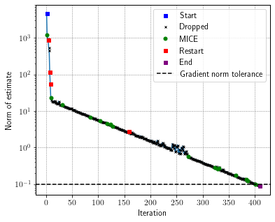
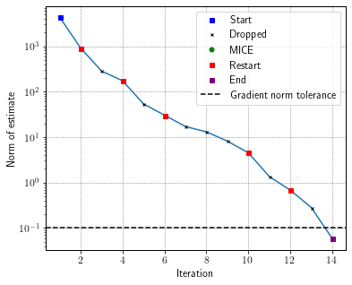
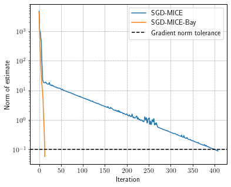
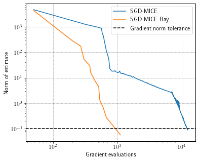

Getting started
===============

*Run this example in*
`colab <https://colab.research.google.com/drive/1B6bGMo2rYvs6IfpBzg0qj8LZnmIyGaq7>`__!

In this example, we use the BayHess package to assist MICE in minimizing
a quadratic function. Let the quadratic function :math:`f` to minimized
be

.. math::

   f(\boldsymbol{\xi}, \theta) = \frac{1}{2} \boldsymbol{\xi} \cdot \boldsymbol{H}(\theta) \boldsymbol{\xi}
   - \boldsymbol{b} \cdot \boldsymbol{\xi}

where

.. math::

   \begin{aligned}
       \boldsymbol{\xi} \quad & \textrm{ is a vector containing the optimization variables, } \\
       \theta \quad & \textrm{ is a random variable, } \\
       f(\boldsymbol{\xi}, \theta) \quad & \textrm{ is a function whose expectation wrt } \theta \textrm{ is to be minimized, } \\
       \boldsymbol{H}(\theta) \quad & \textrm{ is the Hessian matrix, } \\
       \boldsymbol{b} \quad & \textrm{is a vector of the same dimension as } \boldsymbol{\xi}.
       \end{aligned}

Here, we have a Hessian that is a convex combination of the identity
matrix and of an arbitrary matrix:

.. math::

   \boldsymbol{H}(\theta) =
   \boldsymbol{I}_2(1 -\theta) +
   \begin{bmatrix}
   \kappa & \kappa-1 \\
           \kappa-1 & \kappa
   \end{bmatrix}
   \theta,

noting that :math:`\theta` is a random variable such that
:math:`\theta \sim \mathcal{U}[0, 1]` and :math:`\kappa` is the desired
conditioning number of the expected value of the Hessian. Also,
:math:`\boldsymbol{b}` is a 2-dimensional vector with ones.

To use the stochastic gradient method, we need the gradient of :math:`f`
wrt :math:`\boldsymbol{\xi}`:

.. math::

   \nabla_{\boldsymbol{\xi}} f(\boldsymbol{\xi}, \theta) = \boldsymbol{H}(\theta) \boldsymbol{\xi} - \boldsymbol{b}.

First, let’s install both MICE and BayHess from PyPI using pip.

.. code:: ipython3

    %pip install -U mice
    %pip install -U bayhess

.. parsed-literal::

    Requirement already satisfied: mice in /home/andre/miniconda3/envs/p39/lib/python3.9/site-packages (0.1.27)
    Requirement already satisfied: matplotlib>=3.2.0 in /home/andre/miniconda3/envs/p39/lib/python3.9/site-packages (from mice) (3.4.2)
    Requirement already satisfied: pandas>=1.1 in /home/andre/miniconda3/envs/p39/lib/python3.9/site-packages (from mice) (1.3.2)
    Requirement already satisfied: numpy>=1.19 in /home/andre/miniconda3/envs/p39/lib/python3.9/site-packages (from mice) (1.20.3)
    Requirement already satisfied: scipy>=1.8.1 in /home/andre/miniconda3/envs/p39/lib/python3.9/site-packages (from mice) (1.8.1)
    Requirement already satisfied: pillow>=6.2.0 in /home/andre/miniconda3/envs/p39/lib/python3.9/site-packages (from matplotlib>=3.2.0->mice) (9.2.0)
    Requirement already satisfied: python-dateutil>=2.7 in /home/andre/miniconda3/envs/p39/lib/python3.9/site-packages (from matplotlib>=3.2.0->mice) (2.8.2)
    Requirement already satisfied: cycler>=0.10 in /home/andre/miniconda3/envs/p39/lib/python3.9/site-packages (from matplotlib>=3.2.0->mice) (0.11.0)
    Requirement already satisfied: pyparsing>=2.2.1 in /home/andre/miniconda3/envs/p39/lib/python3.9/site-packages (from matplotlib>=3.2.0->mice) (3.0.4)
    Requirement already satisfied: kiwisolver>=1.0.1 in /home/andre/miniconda3/envs/p39/lib/python3.9/site-packages (from matplotlib>=3.2.0->mice) (1.4.2)
    Requirement already satisfied: pytz>=2017.3 in /home/andre/miniconda3/envs/p39/lib/python3.9/site-packages (from pandas>=1.1->mice) (2022.1)
    Requirement already satisfied: six>=1.5 in /home/andre/miniconda3/envs/p39/lib/python3.9/site-packages (from python-dateutil>=2.7->matplotlib>=3.2.0->mice) (1.16.0)
    Note: you may need to restart the kernel to use updated packages.
    Requirement already satisfied: bayhess in /home/andre/miniconda3/envs/p39/lib/python3.9/site-packages (0.1.2)
    Requirement already satisfied: numpy>=1.19 in /home/andre/miniconda3/envs/p39/lib/python3.9/site-packages (from bayhess) (1.20.3)
    Requirement already satisfied: scipy>=1.7.1 in /home/andre/miniconda3/envs/p39/lib/python3.9/site-packages (from bayhess) (1.8.1)
    Note: you may need to restart the kernel to use updated packages.

To use MICE to estimate :math:`\nabla_{\boldsymbol{\xi}} f`, we need to
import the MICE class and NumPy to assist us in defining our problem. We
also import the BayHess class to be used soon.

.. code:: ipython3

    
    import matplotlib.pyplot as plt
    import numpy as np
    from numpy.linalg import solve, norm
    from mice import MICE, plot_mice
    from bayhess import BayHess

Then, we need to define :math:`\nabla_{\boldsymbol{\xi}} f` as a
function of :math:`\boldsymbol{\xi}` and an array representing a sample
of :math:`\theta`.

.. code:: ipython3

    kappa = 100
    H_aux = np.array([[kappa, kappa-1], [kappa-1, kappa]])
    true_hess = np.array([[kappa+1, kappa-1], [kappa-1, kappa+1]])/2
    b = np.ones(2)
    
    
    def dobjf(x, thetas):
        gradients = []
        for theta in thetas:
            H = np.eye(2) * (1 - theta) + H_aux * theta
            gradients.append(H @ x.T - b)
        return np.vstack(gradients)

As for :math:`\theta`, we can pass to MICE either a sampler function
that takes the desired sample size as input and returns the sample or a
list/array containing the data. Here, we will define a function that
returns the uniform sample between 0 and 1,

.. code:: ipython3

    def sampler(n):
        return np.random.uniform(0, 1, int(n))

Now, let’s create an instance of MICE to solve this optimization problem
with tolerance to statistical error of :math:`\epsilon=0.7`, maximum
cost of :math:`10,000` evaluations of
:math:`\nabla_{\boldsymbol{\xi}} f`, and a minimum batch size of
:math:`5`.

.. code:: ipython3

    df = MICE(dobjf,
              sampler=sampler,
              eps=.7,
              min_batch=5,
              stop_crit_norm=0.1)

To perform optimization, we need to set a starting point and a step
size. Here, we know both the :math:`L`-smoothness and the
:math:`\mu`-convexity parameters of the problem, thus we can set the
step size optimally.

.. code:: ipython3

    x = np.array([20., 50.])
    L = kappa
    mu = 1
    step_size = 2 / (L + mu) / (1 + df.eps ** 2)

and, finally, we iterate until MICE’s cost is reached, in which case
df.terminate returns True,

.. code:: ipython3

    while True:
        grad = df(x)
        if df.terminate:
            break
        x = x - step_size * grad

The method get_log returns a Pandas DataFrame with the information of
what happened each iteration

.. code:: ipython3

    log = df.get_log()
    log

.. raw:: html

    

    
    <table border="1" class="dataframe">
      <thead>
        <tr style="text-align: right;">
          <th></th>
          <th>event</th>
          <th>num_grads</th>
          <th>vl</th>
          <th>bias_rel_err</th>
          <th>grad_norm</th>
          <th>iteration</th>
          <th>hier_length</th>
        </tr>
      </thead>
      <tbody>
        <tr>
          <th>0</th>
          <td>start</td>
          <td>50</td>
          <td>6.588308e+06</td>
          <td>0.000000</td>
          <td>4695.389187</td>
          <td>1</td>
          <td>1</td>
        </tr>
        <tr>
          <th>1</th>
          <td>MICE</td>
          <td>326</td>
          <td>1.375789e+07</td>
          <td>0.102251</td>
          <td>1227.318777</td>
          <td>2</td>
          <td>2</td>
        </tr>
        <tr>
          <th>2</th>
          <td>dropped</td>
          <td>494</td>
          <td>6.215808e+05</td>
          <td>0.323431</td>
          <td>967.609250</td>
          <td>3</td>
          <td>3</td>
        </tr>
        <tr>
          <th>3</th>
          <td>restart</td>
          <td>564</td>
          <td>3.010972e+05</td>
          <td>0.000000</td>
          <td>876.481800</td>
          <td>4</td>
          <td>1</td>
        </tr>
        <tr>
          <th>4</th>
          <td>dropped</td>
          <td>584</td>
          <td>3.173592e+05</td>
          <td>0.135645</td>
          <td>545.465263</td>
          <td>5</td>
          <td>2</td>
        </tr>
        <tr>
          <th>...</th>
          <td>...</td>
          <td>...</td>
          <td>...</td>
          <td>...</td>
          <td>...</td>
          <td>...</td>
          <td>...</td>
        </tr>
        <tr>
          <th>404</th>
          <td>dropped</td>
          <td>12330</td>
          <td>1.101072e-04</td>
          <td>0.663222</td>
          <td>0.095459</td>
          <td>405</td>
          <td>10</td>
        </tr>
        <tr>
          <th>405</th>
          <td>dropped</td>
          <td>12370</td>
          <td>2.859101e-05</td>
          <td>0.645569</td>
          <td>0.094172</td>
          <td>406</td>
          <td>10</td>
        </tr>
        <tr>
          <th>406</th>
          <td>dropped</td>
          <td>12400</td>
          <td>6.243965e-05</td>
          <td>0.650190</td>
          <td>0.094283</td>
          <td>407</td>
          <td>10</td>
        </tr>
        <tr>
          <th>407</th>
          <td>dropped</td>
          <td>12440</td>
          <td>4.125492e-05</td>
          <td>0.650354</td>
          <td>0.091576</td>
          <td>408</td>
          <td>10</td>
        </tr>
        <tr>
          <th>408</th>
          <td>end</td>
          <td>12480</td>
          <td>4.103791e-05</td>
          <td>0.648924</td>
          <td>0.090381</td>
          <td>409</td>
          <td>10</td>
        </tr>
      </tbody>
    </table>
    
409 rows × 7 columns

    

Now, let’s plot the convergence of the norm of MICE’s gradient estimates
from the log DataFrame using the built-in plot_mice function.

.. code:: ipython3

    fig, ax = plt.subplots(figsize=(6, 5))
    ax = plot_mice(log, ax, 'iteration', 'grad_norm', style='semilogy')
    ax.axhline(df.stop_crit_norm, ls='--', c='k', label='Gradient norm tolerance')
    ax.set_xlabel('Iteration')
    ax.set_ylabel('Norm of estimate')
    ax.legend()

.. parsed-literal::

    <matplotlib.legend.Legend at 0x7fd955869fa0>

Note that SGD-MICE required 411 iterations to reach the gradient norm
tolerance. Let’s use BayHess to obtain a Hessian approximation and
pre-condition the gradient with its inverse. Before, we will create
another instance of MICE.

.. code:: ipython3

    df_ = MICE(dobjf,
              sampler=sampler,
              eps=.7,
              min_batch=5,
              stop_crit_norm=0.1)

And now, an instance of BayHess with :math:`\beta=10^{-2}` and
:math:`\rho=10^{-2}`.

.. code:: ipython3

    bay = BayHess(n_dim=2, strong_conv=1, smooth=kappa,
                  penal=1e-2, reg_param=1e-2)

Setting the same startin point as for SGD-MICE and a corresponding step
size of :math:`1/(1 + \epsilon^2)`,

.. code:: ipython3

    x = np.array([20., 50.])
    step_size = 1 / (1 + df.eps ** 2)

we can perform optimization using SGD-MICE-Bay.

.. code:: ipython3

    while True:
        grad = df_.evaluate(x)
        bay.update_curv_pairs_mice(df_, x)
        if not df_.k % 3:
            bay.find_hess()
        if df_.terminate:
            break
        x = x - step_size * solve(bay.hess, grad)

Similarly to what we have done before, we can check MICE’s log

.. code:: ipython3

    log_ = df_.get_log()
    log_

.. raw:: html

    

    
    <table border="1" class="dataframe">
      <thead>
        <tr style="text-align: right;">
          <th></th>
          <th>event</th>
          <th>num_grads</th>
          <th>vl</th>
          <th>bias_rel_err</th>
          <th>grad_norm</th>
          <th>iteration</th>
          <th>hier_length</th>
        </tr>
      </thead>
      <tbody>
        <tr>
          <th>0</th>
          <td>start</td>
          <td>50</td>
          <td>8.206547e+06</td>
          <td>0.000000</td>
          <td>4358.977188</td>
          <td>1</td>
          <td>1</td>
        </tr>
        <tr>
          <th>1</th>
          <td>restart</td>
          <td>110</td>
          <td>2.305343e+05</td>
          <td>0.000000</td>
          <td>913.121963</td>
          <td>2</td>
          <td>1</td>
        </tr>
        <tr>
          <th>2</th>
          <td>dropped</td>
          <td>200</td>
          <td>4.531934e+05</td>
          <td>0.228281</td>
          <td>283.607233</td>
          <td>3</td>
          <td>2</td>
        </tr>
        <tr>
          <th>3</th>
          <td>restart</td>
          <td>270</td>
          <td>9.738793e+03</td>
          <td>0.000000</td>
          <td>173.316025</td>
          <td>4</td>
          <td>1</td>
        </tr>
        <tr>
          <th>4</th>
          <td>dropped</td>
          <td>302</td>
          <td>5.558856e+03</td>
          <td>0.248118</td>
          <td>53.630654</td>
          <td>5</td>
          <td>2</td>
        </tr>
        <tr>
          <th>5</th>
          <td>restart</td>
          <td>372</td>
          <td>2.414530e+02</td>
          <td>0.000000</td>
          <td>30.321476</td>
          <td>6</td>
          <td>1</td>
        </tr>
        <tr>
          <th>6</th>
          <td>dropped</td>
          <td>382</td>
          <td>7.639652e+01</td>
          <td>0.122466</td>
          <td>17.108728</td>
          <td>7</td>
          <td>2</td>
        </tr>
        <tr>
          <th>7</th>
          <td>dropped</td>
          <td>402</td>
          <td>1.583018e+02</td>
          <td>0.160855</td>
          <td>13.025718</td>
          <td>8</td>
          <td>2</td>
        </tr>
        <tr>
          <th>8</th>
          <td>dropped</td>
          <td>442</td>
          <td>2.286118e+02</td>
          <td>0.257132</td>
          <td>8.148506</td>
          <td>9</td>
          <td>2</td>
        </tr>
        <tr>
          <th>9</th>
          <td>restart</td>
          <td>512</td>
          <td>6.888974e+00</td>
          <td>0.000000</td>
          <td>4.512811</td>
          <td>10</td>
          <td>1</td>
        </tr>
        <tr>
          <th>10</th>
          <td>dropped</td>
          <td>532</td>
          <td>2.132636e+00</td>
          <td>0.261287</td>
          <td>1.354497</td>
          <td>11</td>
          <td>2</td>
        </tr>
        <tr>
          <th>11</th>
          <td>restart</td>
          <td>602</td>
          <td>1.113125e+00</td>
          <td>0.000000</td>
          <td>0.679711</td>
          <td>12</td>
          <td>1</td>
        </tr>
        <tr>
          <th>12</th>
          <td>dropped</td>
          <td>672</td>
          <td>2.213795e-02</td>
          <td>0.257727</td>
          <td>0.281719</td>
          <td>13</td>
          <td>2</td>
        </tr>
        <tr>
          <th>13</th>
          <td>end</td>
          <td>1113</td>
          <td>6.260119e-01</td>
          <td>0.000000</td>
          <td>0.058472</td>
          <td>14</td>
          <td>1</td>
        </tr>
      </tbody>
    </table>
    

And make a convergence plot.

.. code:: ipython3

    fig, ax = plt.subplots(figsize=(6, 5))
    ax = plot_mice(log_, ax, 'iteration', 'grad_norm', style='semilogy')
    ax.axhline(df_.stop_crit_norm, ls='--', c='k', label='Gradient norm tolerance')
    ax.set_xlabel('Iteration')
    ax.set_ylabel('Norm of estimate')
    ax.legend()

.. parsed-literal::

    <matplotlib.legend.Legend at 0x7fd9557a0f70>

To better illustrate the difference, let’s make a convergence plot
comparing SGD-MICE with and without the Bayesian Hessian
pre-conditioning.

.. code:: ipython3

    fig, ax = plt.subplots(figsize=(6, 5))
    ax.semilogy(log["grad_norm"], label="SGD-MICE")
    ax.semilogy(log_["grad_norm"], label="SGD-MICE-Bay")
    ax.axhline(df_.stop_crit_norm, ls='--', c='k', label='Gradient norm tolerance')
    ax.set_xlabel('Iteration')
    ax.set_ylabel('Norm of estimate')
    ax.legend()

.. parsed-literal::

    <matplotlib.legend.Legend at 0x7fd9555f5f70>

Still, due to MICE’s adaptive control of the relative statistical error,
the number of gradient evaluations changes per iteration. Let’s take a
look at the convergence versus the number of gradient evaluations.

.. code:: ipython3

    fig, ax = plt.subplots(figsize=(6, 5))
    ax.loglog(log["num_grads"], log["grad_norm"], label="SGD-MICE")
    ax.loglog(log_["num_grads"], log_["grad_norm"], label="SGD-MICE-Bay")
    ax.axhline(df_.stop_crit_norm, ls='--', c='k', label='Gradient norm tolerance')
    ax.set_xlabel('Gradient evaluations')
    ax.set_ylabel('Norm of estimate')
    ax.legend()

.. parsed-literal::

    <matplotlib.legend.Legend at 0x7fd955af0610>

Using the Hessian approximation from BayHess resulted in a dramatic
reduction in the cost of achieving the desired tolerance.

.. code:: ipython3

    reduction = (log["num_grads"].max() - log_["num_grads"].max()) / log["num_grads"].max()*100
    print(f"BayHess reduced the overall cost in {reduction:.3f} %")

.. parsed-literal::

    BayHess reduced the overall cost in 91.082 %

